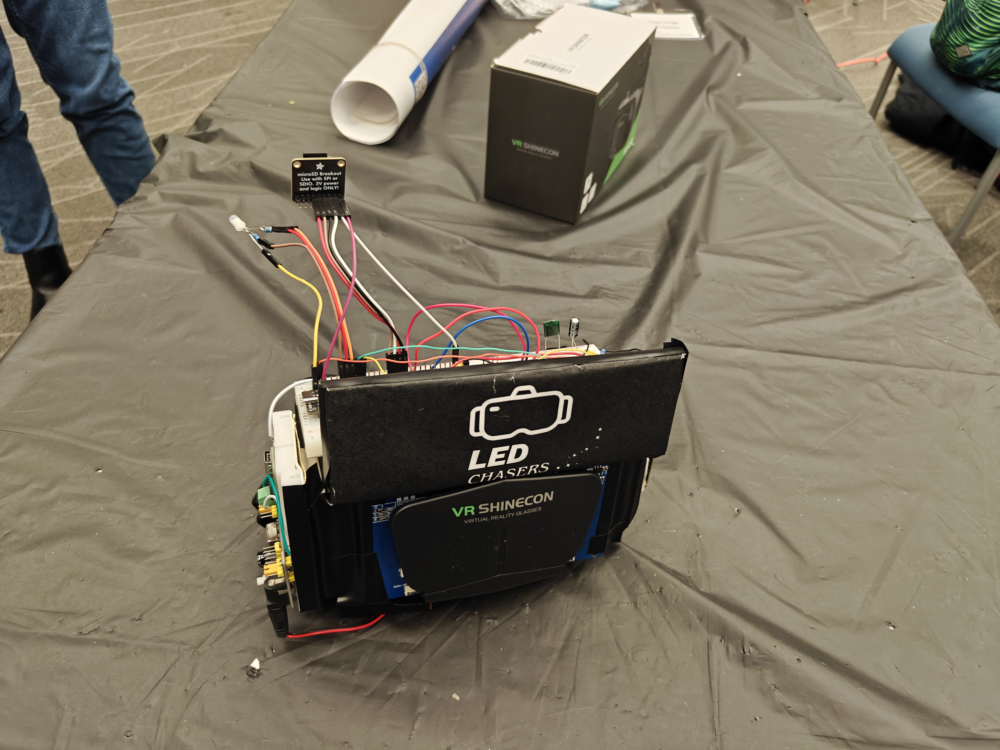
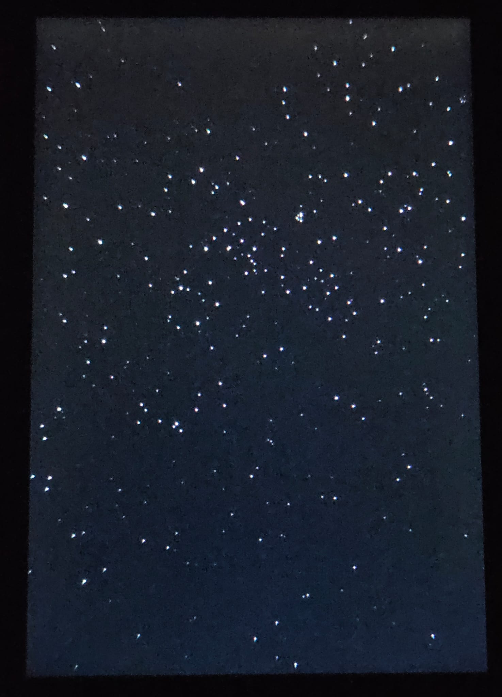
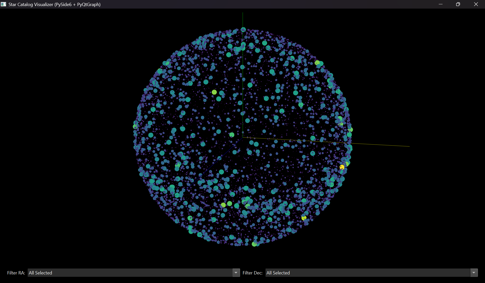
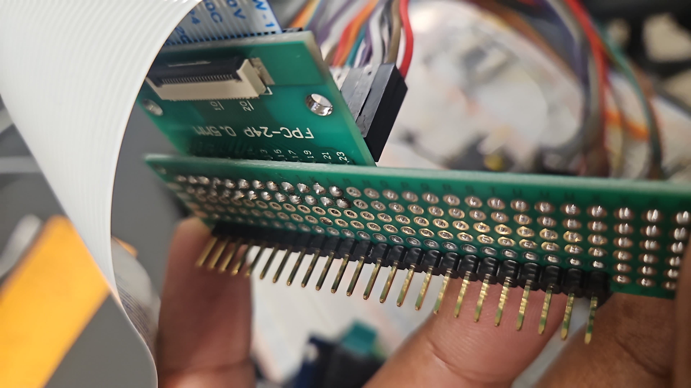
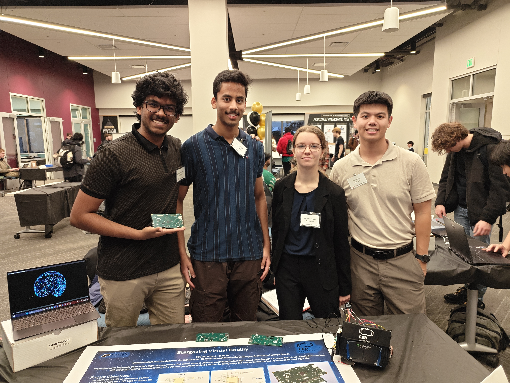

# Stargazer VR


*A high-performance, standalone VR headset powered by the RP2350 that renders real-time star constellations based on precise geolocation and orientation.*

---

## 📖 Introduction

Light pollution is a problem not many people talk about. We wanted to shed light on this issue (pun intended), so we decided to build a VR headset that let the user see the night sky at the comfort of their home. 

This project is a wearable headset with an RP2350 microcontroller and two 3.5" TFT LCD displays to display stars and constellations in the sky, in the direction of the viewer sight. It uses a BNO085 IMU to track the user movements, a NEO-M10 GPS module to obtain present location, date, and time, and an SD Card to store a large catalog of star location data in a binary file.

### ⭐ Spotlight


*VR Headset assembled with a case, breadboards, and standard parts.*


*View from a single screen during operation.*

[](https://youtu.be/E_Z8thj5-Y4?si=hsxMM6rmYNDNSfJs)

*360 Degree View of the Headset*

---

## 📑 Table of Contents

Our Story

- [Features](#-features)
- [Instructions for Usage](#-instructions-for-usage)
- [Software Developement](#-software-development)
  - [The Rendering Pipeline](#-the-rendering-pipeline)
  - [Side Quest 1: Scripting](#-side-quest-1-scripting)
  - [Optimizations](#-optimizations)
- [Hardware Building](#-hardware-building)
  - [The Physical Design](#-the-physical-design)
  - [So many issues!](#-so-many-issues)
  - [Side Quest 2: PCB Design](#-side-quest-2-pcb-design)
  - [Putting it all together](#-putting-it-all-together)
- [Closing Thoughts](#-closing-thoughts)

<a id="-features"></a>
## 🚀 Features

The headset runs on a standard 9V battery, has two 3.5" TFT LCDs that display stars in front of the user with a 100 degree FOV. A single RGB LED is used to indicate the state of the VR Headset: booting, running, paused, critical error, etc. There are 3 buttons used to control the headset program flow. The Tare button recalibrates the IMU to face true North, the GPS toggle button switches between using real time GPS data and an in-built location and time (Purdue J2000), and the Pause/Play button does exactly that.

A single microSD card containing the required binary file format of star data can be inserted. Upon startup, this data is loaded into the RAM and processed. The catalog is limited to 15,000 stars. To produce the bin file, see [process_fits.py](data/scripts/process_fits.py), a script written to convert an fit file into the needed bin file.

The LCD Displays (ILI9486) as well as the microSD Card are controlled using SPI. The IMU (BNO085) is communicated with using I2C, more specifically SHTP. Finally, the GPS Module (Neo-M10) uses UART to transmit NMEA sentences.

---

[](https://youtu.be/3412y5BKB1g?si=uu_Z9wU7jyXM4vg-)

*A short demonstration of the Headset working.*


[](https://youtu.be/89O6f0i35UU?si=O_-78V77JQVSeXiZ)

*A demonstration of the UI of the headset.*

---

<a id="-instructions-for-usage"></a>
## 📃 Instructions for Usage

If wiring up on a breadboard, refer to the KiCad schematic for exact resistor values to use for the RGB LED, and connections to configure the IMU in I2C mode. Everything else works as it should assuming the use of breakout boards. Any standard LDO can be used to provide the 5V supply from the 9V battery. 

> [!WARNING]
> Do not connect a 3V3 output of your MCU to the LCDs! SST drivers have boost converters in them (as you should if you're implementing your own driver) and the current draw from 2 LCDs is too much current draw. You need a seperate regulator to provide external 3V3 from your 9V external.

If you're using the PCB, it's a plug and play. It needs the Adafruit BNO085 IMU breakout board (they were out of stock when this was designed). The PCB also makes use of 16 bit 8080 for the displays, making it significantly faster. Instead of a 9V battery, it will need a LiPo battery rated for above 1A. It can be charged with a wall charger, and programmed using a Pico probe.

---

<a id="-software-development"></a>
## 🖥️ Software Development

We started with the software. Before wiring anything up, we began testing our design flow of using interrupts for timers, PWM, and GPIO. Then we went on to the more complex aspects like the communication with peripherals.

<a id="-the-rendering-pipeline"></a>
### 🚄 The Rendering Pipeline

The critical path is IMU to display, and it runs at 200Hz. The IMU generates in interrupt, which triggers main to read data, process it, find the final rotation, generate the star list, and draw/erase the display. Everything else, such as state setting, GPS reading, IMU taring, etc happen in the remaining 5ms between reads. 

The watchdog in the MCU is set to 1000ms and cleared every 200ms, so if there's a deadlock (especially an issue with the GPS), the system reboots.

<a id="-side-quest-1-scripting"></a>
### 🎬 Side Quest 1: Scripting

Python scripts were the method we used to get stuff done.

[process_fits.py](data/scripts/process_fits.py) is the most critical one. We used it to generate the needed binary file from a heavy fit file. Used ```astropy```.

[game_rot.py](data/scripts/game_rot.py) is more of an IMU debugging script. It reads game rotation vectors from the IMU and allows visualization of the data in 3D using ```pyqtgraph``` and ```PySide6```.

[see_stars.py](data/scripts/see_stars.py) is meant to test the sorting algorithm written to run on g++ in [test_buf_sort.cpp](data/scripts/test_buf_sort.cpp) by displaying the sorted data as patches on a 3D sphere. It's a neat visualization of how the data looks.


*Visualization of data sorted into 12 bins of Declination and 24 bins of Right Ascension.*

The remaining scripts were used to emulate the LCDs for debugging and calibrating purposes. They're more effective when you handwrite a small batch (~10) of test stars.

<a id="-optimizations"></a>
### 🪡 Optimizations

The first major optimization we used in this project was the use of quaternions for rotations. Instead of Euler angles, which are hard to visualize and are prone to gimbal lock, we used quaternions, which are 4D complex numbers, and are a completely neat set of mathematics immune to any edge cases. They literally describe rotations in the purest sense, with a single quaternion essentially behaving like a 3x3 rotation matrix meant to be applied on a 3x1 coordinate vector. Each of the 3 main factors - Location, Date/Time, and IMU vector - are all expressed as seperate quaternions, and combining them to obtain a single final rotation quaternions is akin to multiplying 3 matrices together!

$$ q_{final} = q_{IMU} \cdot q_{location} \cdot q_{time} $$

$$ v_{final} = q_{final} \cdot v_{J2000} \cdot q_{final}^{*} $$

Our next optimization was Spatial Culling, optimizing in what to do with this final rotation. Applying it to all stars only to then narrow down a 100 degree FOV would be far too expensive computationally. Instead, we applied the inverse rotation to the perspective vector, and then checked which set of stars could appear on screen. That's where the bin sorting came into play. The 288 patches were sorted based on RA and DEC, allowing easy access of patches to then apply the rotation to. 

Finally, we used double buffering to allow erasing of old stars and drawing of new ones together. Keeping this rate maxed out, it even created an unintentional twinkling effect of stars! It's not a bug, it's a feature.

---

<a id="-hardware-building"></a>
## 🛠️ Hardware Building

While the code was being developed, stuff was getting wired up on the breadboard! Starting with the RGB LED, then moving to the IMU, GPS, SD Card, and finally, the displays. This was just the process of integration, of course. Everything software and hardware was being developed and tested slowly at the same time.

<a id="-the-physical-design"></a>
### The Physical Design

On the breadboard, there wasn't much to do. We simplified a lot of wiring by using breakout boards for all parts. Appropriate resistor sizes were chosen for the RGB LED and soldered. Everything else was just connected with regular wiring. The breadboard design was arguably the easiest part of this project. We got ourselves a 9V to breadboard supply board that provided the needed 5V and 3V3 supplies. That with a USB-C breakout was all we needed. Refer to [config.h](include/config.h) for exact connections for breadboarding. Remember, the PCB was different! Check the schematic for that.

<a id="-so-many-issues"></a>
### So many issues!

We initially tried to speed up graphics by using PIO to communicate with the LCDs through 16-bit 8080. Using long and noisy wires, this ended up being a bit of a mess.


*FPC connector to breadboard wire soldering*

Due to the noise in these wires and the precise timing requirements, we scrapped this idea after a lot of failed attempts, and moved back to SPI. The same issue happened to the microSD Card, where SDIO may not have been feasible due to the wiring size. Hence, both were moved back to SPI.

An interesting challenge faced was balancing timing with performance. What was the fastest we could go without messing up the visuals? How much gap did we give between render frames? And how much did we zoom into a patch? There were several calibration challenges that needed solving. And then there was the issue of making sure there was enough space on the board for all connections. [main.cpp](src/main.cpp) and [config.h](include/config.h) have the exact timings.

<a id="-side-quest-2-pcb-design"></a>
### Side Quest 2: PCB Design

Making the PCB took an all nighter. It uses the same RP2350B with the same set of parts. It's important to note that due to vendor shortage, the IMU was replaced with headers for the Adafruit breakout board for BNO085. Due to the requirements of moving the displays, 2 FPC connectors were installed at the edge of the PCB for displaying. Due to the noise requirements, the GPS module is connected with a JST connector, to prevent the antenna from catching noise. 

Finally, the device is programmed with the Pico Probe headers and powered by a rechargeable LiPo battery. The USB-C receptacle can either charge the battery during runtime, or power the device. Charging needs the supercharge switch enabled, and it has to be connected to a wall socket. Excess current draw will trigger a laptop polyfuse if you try charging.

<a id="-putting-it-all-together"></a>
### Putting it all together

Everything was held together with electrical tape. And it worked well! The occasional loose connection was annoying, but the project worked nevertheless. We had to end up using the breadboards as opposed to the PCB, though. That was a bit sad, but seeing the headset work was awesome!

---

<a id="-closing-thoughts"></a>
## 📦 Closing Thoughts

Despite all the issues we faced, we were able to showcase our project at the Purdue University Spark Challenge in December 2025. Showing the project to friends and teachers alike was an unforgettable experience. 

Technically speaking, there's a good number of improvements that can be made. Small adjustments like adjusting x and z FOVs as well as star pixel designs are user choices. Speed optimizations can be made, too. Firstly, swapping out normal writing for DMA would significantly speed up LCD display drawing. So would a parallel interface and using the RP2350 dual core capabilities to seperate computations and rendering.

Thankfully, the project is really modular. Every file works independantly, and swapping out mechanisms is definitely a large area for improvement that can be achieved.


*LED Chasers - (L to R) Sandeep Saravanakumar, Surya Turaga, Madelyn Zavada, Ryan Yoong*
