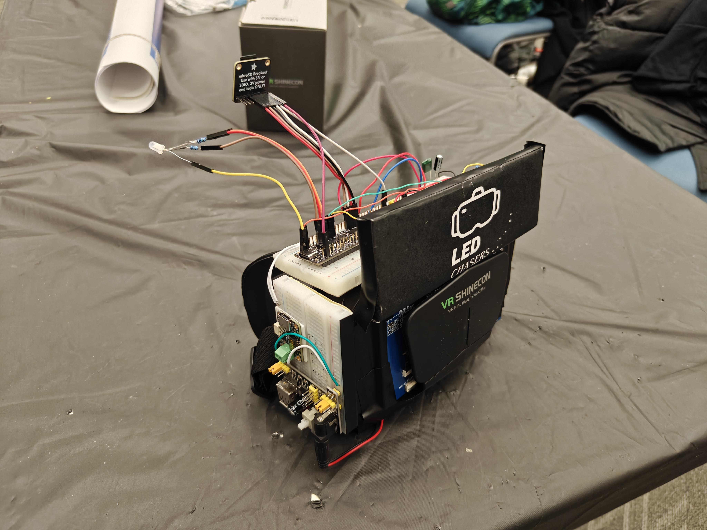

# Stargazer VR

*A high-performance, standalone VR headset powered by the RP2350 that renders real-time star constellations based on precise geolocation and orientation.*

---

## 📖 Introduction

Light pollution is a problem not many people talk about. We wanted to shed light on this issue (pun intended), so we decided to build a VR headset that let the user see the night sky at the comfort of their home. 

This project is a wearable headset with an RP2350 microcontroller and two 3.5" TFT LCD displays to display stars and constellations in the sky, in the direction of the viewer sight. It uses a BNO085 IMU to track the user movements, a NEO-M10 GPS module to obtain present location, date, and time, and an SD Card to store a large catalog of star location data in a binary file.

### ⭐ Spotlight

(Images here)

---

## 📑 Table of Contents

Our Story

- [Features](#-features)
- [Instructions for Usage](#-instructions-for-usage)
- [Design Stages](#-design-stages)
- [Software Developement](#-software-development)
  - [The Rendering Pipeline](#-the-rendering-pipeline)
  - [Side Quest 1: Scripting](#-side-quest-1-scripting)
  - [Optimizations](#-optimizations)
- [Hardware Building](#-hardware-building)
  - [The Physical Design](#-the-physical-design)
  - [So many issues!](#-so-many-issues)
  - [Side Quest 2: PCB Design](#-side-quest-2-pcb-design)
  - [Putting it all together](#-putting-it-all-together)
- [Closing Thoughts](#-closing-thoughts)

## 🚀 Features

Short summary of how it is, and how it behaves.

---

## 📃 Instructions for Usage

Give instructions for following the config.h file for the wiring up of the circuit. Provide some resistor values and warnings like external power supplies and what not.

Also give the tools like venv and stuff needed to run the scripts. Mention the makefile.

---

## 📐 Design Stages

Give a short flow of what all we went about doing. Basically a short story.

---

## 🖥️ Software Development

We started with the software. Before wiring anything up, we began testing our design flow of using interrupts for timers, PWM, and GPIO. Then we went on to the more complex aspects like the communication with peripherals.

### 🚄 The Rendering Pipeline

Short desc. Mermaid flowchart?

### 🎬 Side Quest 1: Scripting

Short desc again. Show some images.

### 🪡 Optimizations

Give an idea of quaternion math, spatial culling, double buffering.

---

## 🛠️ Hardware Building

While the code was being developed, stuff was getting wired up on the breadboard! Starting with the RGB LED, then moving to the IMU, GPS, SD Card, and finally, the displays. This was just the process of integration, of course. Everything was being developed and tested slowly at the same time.

### The Physical Design

Outline the choices made and what we started with

Put a pic.

### So many issues!

Short summary of problems we faced and how we adapted

### Side Quest 2: PCB Design

Short summary of making the PCB and what happened with it. Put a picture!

### Putting it all together

Finally, assembling the headset! Keep this short with pics.

---

## 📦 Closing Thoughts

Showcase at spark and final thoughts on how the project could be improved and what not. End with group photo.
